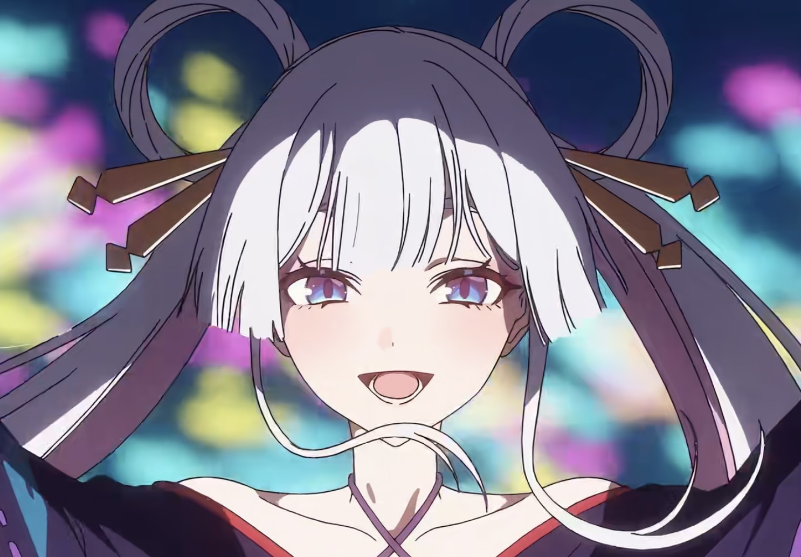

</svg><div align="center">
  <h1>
    Hi there, I'm ᙭IᗩOᗰᗩO
    
  </h1>
</div>


<a href="https://github.com/yxmmmm" align="right">
  <picture>
    <source
      srcset="./profile/stats-dark.svg"
      media="(prefers-color-scheme: dark)"
    />
    <source
      srcset="./profile/stats-light.svg"
      media="(prefers-color-scheme: light)"
    />
    
  </picture>
</a>


<div align="left">
  <h4>
    A student at Nanjing Forestry University.<br>
    Studying computer systems to build an operating system one day! 
  </h4>
</div>

You are !
 My personal website: [](https://xiaomaoyang.top)


##  𝑨 𝒍𝒊𝒕𝒕𝒍𝒆 𝒎𝒐𝒓𝒆 𝒂𝒃𝒐𝒖𝒕 𝒎𝒆…


```golang
var Me = xiaomao{
    MBTI:    "ENTP",
    Code:    []string{"C/C++"},
    School:  "Nanjing Forestry University",
    Website: "xiaomaoyang.top",
}
```

<br clear="right"/>


<div align="center">
  <h1>
    𝑻𝒉𝒂𝒏𝒌𝒔 𝒇𝒐𝒓 𝒗𝒊𝒔𝒊𝒕𝒊𝒏𝒈!
  </h1>
</div>


  <em><b>I enjoy independent thinking and taking on challenging tasks.</b><br>If you are also interested in Computer Science, feel free to connect and share ideas!</em>

<div align="center">

</div>
