  <h2>
    
    
  </h2>

<a href="https://github.com/linmoh" align="right">
  <picture>
    <source
      srcset="./profile/stats-dark.svg"
      media="(prefers-color-scheme: dark)"
    />
    <source
      srcset="./profile/stats-light.svg"
      media="(prefers-color-scheme: light)"
    />
    
  </picture>
</a>

<em>A Grade 9 student at Pingyin Experimental High School. 
Studying computer systems to  <strong>build an operating system</strong> one day! </em>

You are !

  

---

###  A little more about me...

  

<pre><code class="language-go">
var Me = LinMohan{
    MBTI:     "INTJ",
    Code:     []string{"C/C++", "Golang", "Java", "JavaScript", "HTML/CSS"},
    School:   "Pingyin Experimental Senior High School (Grade 9)",
    Team:     "TATEN",
    Goal:     "Shandong University",
    Website:  "linmohan.fun",
}
</code></pre>

  <h2>
    
  </h2>

  <em><b>I enjoy independent thinking and taking on challenging tasks.</b> If you are also interested in Computer Science, feel free to connect and share ideas!</em>

